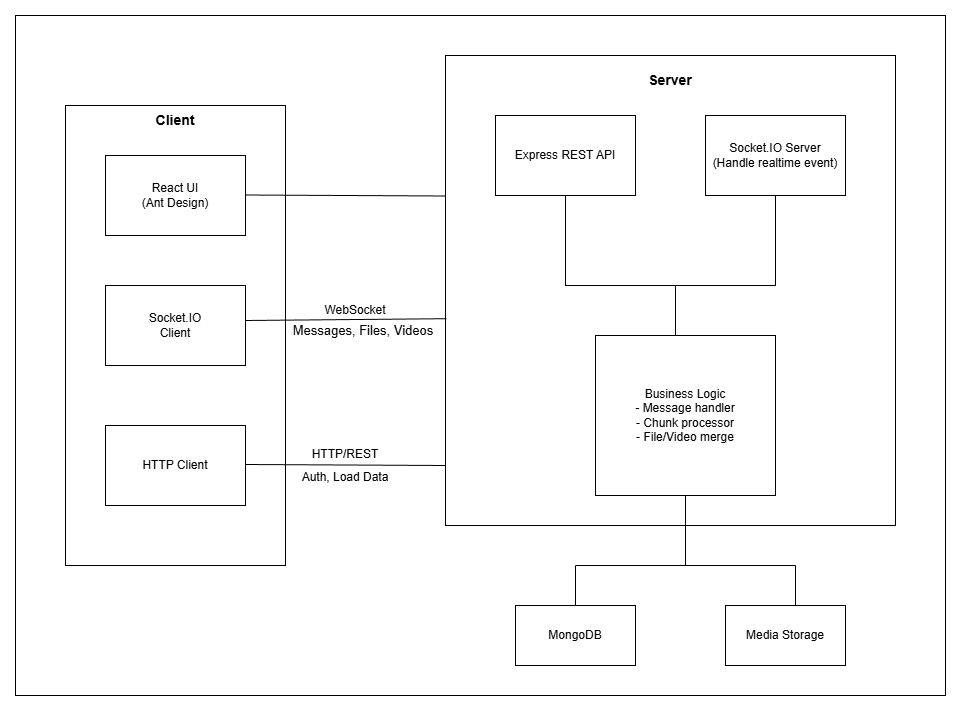
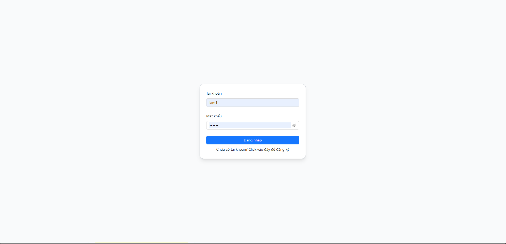
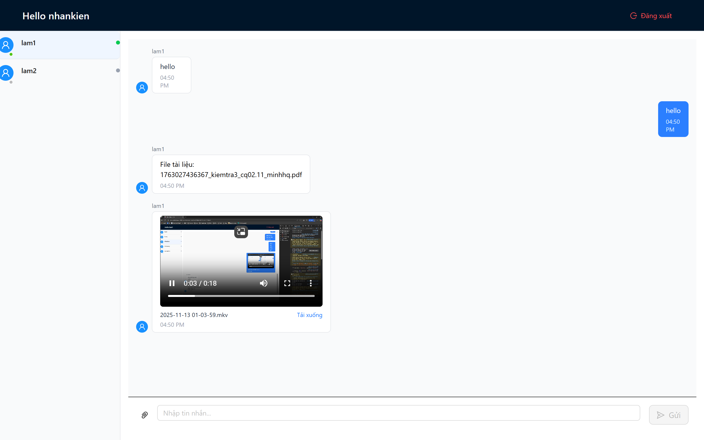
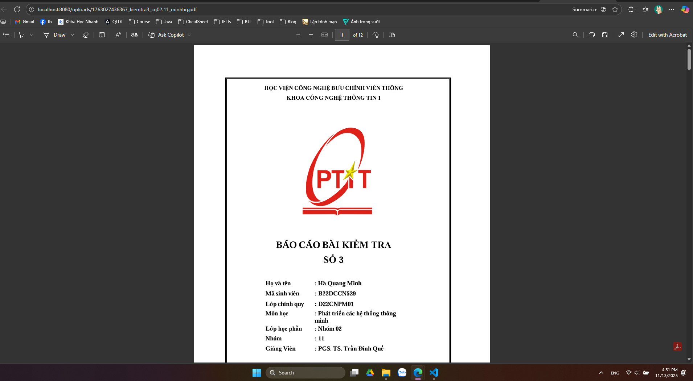

# BÀI TẬP LỚN: LẬP TRÌNH MẠNG

## Xây dựng ứng dụng Chat-Realtime

> 📘 _Mẫu README này là khung hướng dẫn. Sinh viên chỉ cần điền thông tin của nhóm và nội dung dự án theo từng mục._

---

## 🧑‍💻 THÔNG TIN NHÓM

| STT | Họ và Tên         | MSSV       | Email                             | Đóng góp                                                   |
| --- | ----------------- | ---------- | --------------------------------- | ---------------------------------------------------------- |
| 1   | Trịnh Quang Lâm   | B22DCCN482 | lamtq.b22cn482@stu.ptit.edu.vn    | Xây dựng tính năng gửi video thông qua giao thức websocket |
| 2   | Vũ Nhân Kiên      | B22DCCN434 | kienvn.b22cn434@stu.ptit.edu.vn   | Xây dựng tính năng gửi file thông qua giao thức websocket  |
| 3   | Cao Thị Thu Hương | B22DCCN422 | huongctt.b22cn422@stu.ptit.edu.vn | Xây dựng tính năng chat cơ bản                             |

**Tên nhóm:** Nhóm 19 – Lập trình mạng

---

## 🧠 MÔ TẢ HỆ THỐNG

> Hệ thống là một ứng dụng chat thời gian thực, cho phép người dùng trao đổi tin nhắn và chia sẻ dữ liệu.
> Ứng dụng gồm server xử lý yêu cầu và client giao tiếp với server thông qua giao thức WebSocket.
> Server chịu trách nhiệm quản lý người dùng, xử lý tin nhắn và truyền dữ liệu thời gian thực,
> trong khi client là một ứng dụng web hỗ trợ đăng ký, đăng nhập, nhắn tin, gửi file và gửi video.

**Cấu trúc logic tổng quát:**

```
client  <-->  server  <-->  database
```

**Sơ đồ hệ thống:**



---

## ⚙️ CÔNG NGHỆ SỬ DỤNG

| Thành phần | Công nghệ                                         | Ghi chú                                                          |
| ---------- | ------------------------------------------------- | ---------------------------------------------------------------- |
| Server     | NodeJS 20 + ExpressJS + socket.io                 | Xử lý logic, quản lý kết nối realtime                            |
| Client     | NodeJS 20 + ReactJS 18 + socket.io-client + Axios | Giao tiếp WebSocket + HTTP                                       |
| Database   | MongooDB                                          | Lưu trữ dữ liệu tạm thời                                         |
| Triển khai | Docker Engine 27.3.1 + Docker Compose 2.29.7      | Đóng gói ứng dụng, sẵn sàng triển khai lên môi trường production |

---

## 🚀 HƯỚNG DẪN CHẠY DỰ ÁN

### Cách 1: Chạy thủ công

**1. Clone repository**

```bash
git clone https://github.com/jnp2018/mid-project-482422434.git assignment-network-project
cd assignment-network-project
```

**2. Chạy server**

```bash
cd source/server
npm install # cài đặt các thư viện cần thiết
npm run dev # chạy ứng dụng với môi trường development
```

**3. Chạy client**

```bash
cd source/client
npm install # cài đặt các thư viện cần thiết
npm run dev # chạy ứng dụng với môi trường development
```

**4. Kiểm thử nhanh**

Truy cập tại địa chỉ:

```bash
http://localhost:3000
```

### Cách 2: Chạy với Docker (Khuyến khích)

**1. Clone repository**

```bash
git clone https://github.com/jnp2018/mid-project-482422434.git assignment-network-project
cd assignment-network-project
```

**2. Vào thư mục chứa file build**

```bash
cd source
```

**3. Chạy dự án**

```bash
docker-compose up -d
```

**4. Kiểm thử nhanh**

Truy cập tại địa chỉ:

```bash
http://localhost:3000
```

---

## 🔗 GIAO TIẾP (GIAO THỨC SỬ DỤNG)

### HTTP REST API

| Endpoint                            | Protocol | Method | Input                                                                        | Output                                                      |
| ----------------------------------- | -------- | ------ | ---------------------------------------------------------------------------- | ----------------------------------------------------------- |
| `/api/user/login`                   | HTTP/1.1 | POST   | `{ username: string, password: string }`                                     | `{ status: number, message: string, data: Object }`         |
| `/api/user/register`                | HTTP/1.1 | POST   | `{ username: string, password: string, confirmPassword: string }`            | `{ status: number, message: string, data: Object }`         |
| `/api/conversations/users`          | HTTP/1.1 | GET    | Headers: `Authorization: Bearer <token>`                                     | `{ status: number, message: string, data: Array<User> }`    |
| `/api/conversations/find-or-create` | HTTP/1.1 | POST   | `{ username: string }`<br>Headers: `Authorization: Bearer <token>`           | `{ status: number, message: string, data: Conversation }`   |
| `/api/message/:conversationId`      | HTTP/1.1 | GET    | Params: `conversationId: string`<br>Headers: `Authorization: Bearer <token>` | `{ status: number, message: string, data: Array<Message> }` |

### WebSocket Events

**Connection:** `ws://localhost:8080`

**Authentication:** Client phải gửi token qua query parameter hoặc handshake headers

| Event                   | Direction       | Payload                                                                                                                   | Response/Broadcast                                                                |
| ----------------------- | --------------- | ------------------------------------------------------------------------------------------------------------------------- | --------------------------------------------------------------------------------- |
| `connect`               | Client → Server | Query: `{ token: string }`                                                                                                | Kết nối WebSocket được thiết lập                                                  |
| `join-conversation`     | Client → Server | `{ conversationId: string }`                                                                                              | Client join vào room của conversation                                             |
| `leave-conversation`    | Client → Server | `{ conversationId: string }`                                                                                              | Client leave room của conversation                                                |
| `send-message`          | Client → Server | `{ receiverUsername: string, content: string, type: "text" }`                                                             | Callback: `{ success: boolean, message: Object }`<br>Broadcast: `receive-message` |
| `receive-message`       | Server → Client | `{ message: { _id: string, content: string, senderId: Object, type: string, createdAt: Date }, conversationId: string }`  | Client nhận tin nhắn mới                                                          |
| `file-metadata`         | Client → Server | `{ fileId: string, originalName: string, size: number, mimeType: string, totalChunks: number, receiverUsername: string }` | Callback: `{ success: boolean }`                                                  |
| `file-chunk`            | Client → Server | `{ fileId: string, chunkIndex: number, data: string (base64) }`                                                           | Callback: `{ success: boolean, chunkIndex: number }`                              |
| `file-upload-complete`  | Client → Server | `{ fileId: string, receiverUsername: string }`                                                                            | Callback: `{ success: boolean, message: Object }`<br>Broadcast: `receive-message` |
| `video-metadata`        | Client → Server | `{ fileId: string, originalName: string, size: number, mimeType: string, totalChunks: number, receiverUsername: string }` | Callback: `{ success: boolean }`                                                  |
| `video-chunk`           | Client → Server | `{ fileId: string, chunkIndex: number, totalChunks: number, data: ArrayBuffer \| string (base64) }`                       | Callback: `{ success: boolean, chunkIndex: number }`                              |
| `video-upload-complete` | Client → Server | `{ fileId: string, receiverUsername: string }`                                                                            | Callback: `{ success: boolean, message: Object }`<br>Broadcast: `receive-message` |
| `disconnect`            | Client → Server | —                                                                                                                         | Ngắt kết nối, cleanup resources                                                   |

---

## 📊 KẾT QUẢ THỰC NGHIỆM







---

## 🧩 CẤU TRÚC DỰ ÁN

```
assignment-network-project/
├── README.md
├── INSTRUCTION.md
├── statics/
│   ├── diagram.png
│   ├── demo-1.png
│   ├── demo-2.png
│   └── demo-3.png
└── source/
    ├── server/
    │   ├── node_modules
    │   ├── src/
    │   │   ├── config
    │   │   ├── controllers
    │   │   ├── middlewares
    │   │   ├── models
    │   │   ├── routes
    │   │   ├── services
    │   │   ├── shared
    │   │   ├── sockets
    │   │   ├── index.ts
    │   │   └── type.d.ts
    │   ├── uploads
    │   ├── .editorconfig
    │   ├── .gitignore
    │   ├── .prettierignore
    │   ├── .prettierrc
    │   ├── eslint.config.mjs
    │   ├── nodemon.json
    │   ├── package-lock.json
    │   ├── package.json
    │   └── tsconfig.json
    └── client/
        ├── node_modules
        ├── public
        ├── src/
        │   ├── app/
        │   │   ├── layout
        │   │   ├── pages
        │   │   ├── styles
        │   │   ├── index.tsx
        │   │   └── router.tsx
        │   ├── services
        │   ├── shared/
        │   │   ├── components
        │   │   ├── constants
        │   │   ├── context
        │   │   ├── hook
        │   │   ├── services
        │   │   ├── types
        │   │   └── utils
        │   └── vite-env.d.ts
        ├── .editorconfig
        ├── .gitignore
        ├── .prettierignore
        ├── .perttierrc
        ├── eslint.config.js
        ├── index.html
        ├── package-lock.json
        ├── packge.json
        ├── tsconfig.app.json
        ├── tsconfig.json
        ├── tsconfig.node.json
        └── vite.config.ts
```

---

## 🧩 HƯỚNG PHÁT TRIỂN THÊM

> Nêu ý tưởng mở rộng hoặc cải tiến hệ thống.

- Thêm tính năng nhóm chat và gọi video để người dùng có thể trò chuyện theo nhóm hoặc gọi trực tiếp qua trình duyệt.
- Tích hợp chatbot hỗ trợ tự động, giúp gợi ý phản hồi nhanh hoặc trả lời các câu hỏi cơ bản.
- Bổ sung thông báo đẩy (push notification) khi có tin nhắn mới hoặc tệp được gửi đến người dùng.
- Lưu trữ tin nhắn trên cloud và đồng bộ đa thiết bị, giúp người dùng truy cập lịch sử trò chuyện ở mọi nơi.

---

## 📝 GHI CHÚ

- Repo tuân thủ đúng cấu trúc đã hướng dẫn trong `INSTRUCTION.md`.
- Đảm bảo test kỹ trước khi submit.

---

## 📚 TÀI LIỆU THAM KHẢO

> [1] https://socket.io/docs/v4
